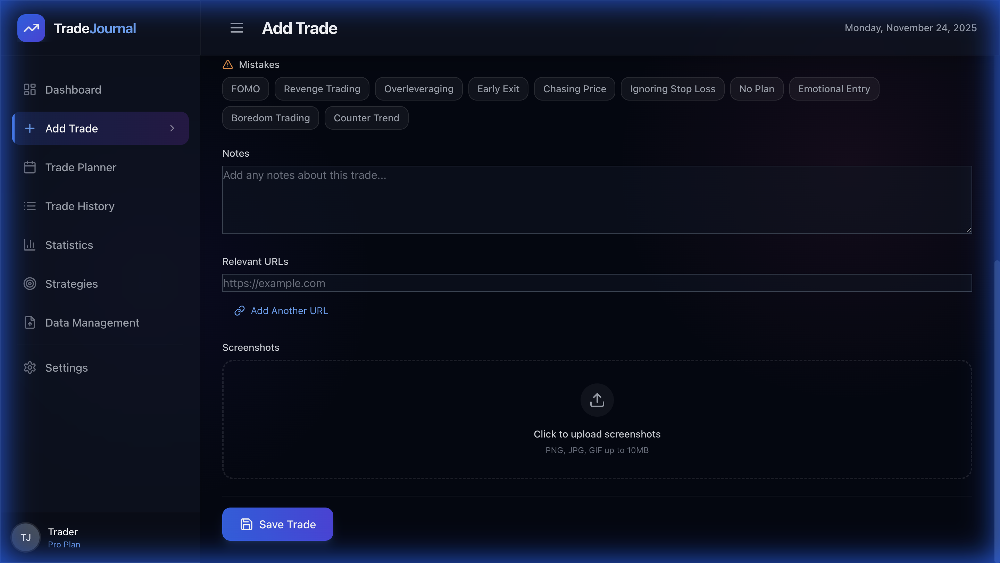
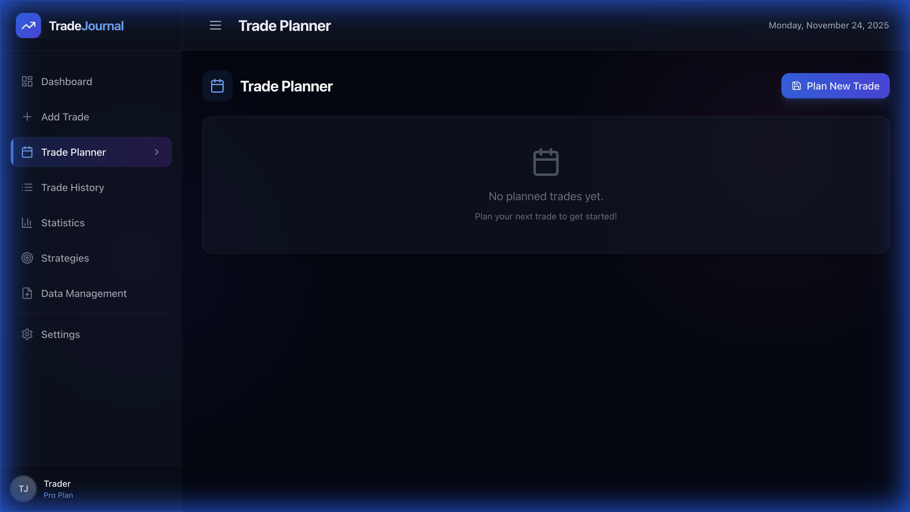
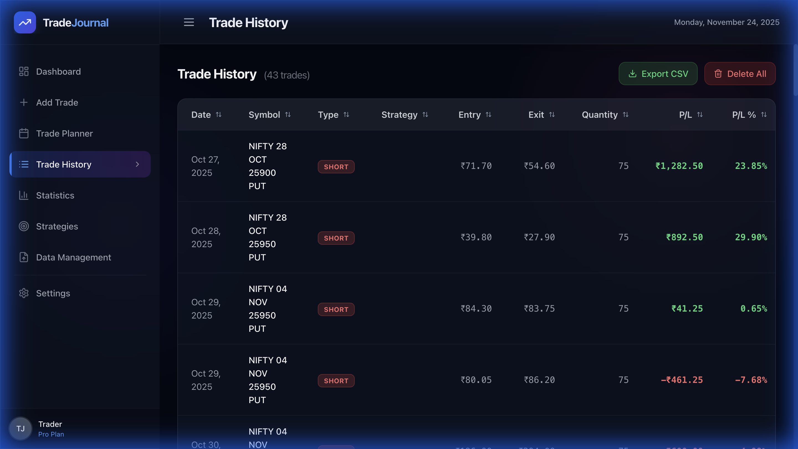
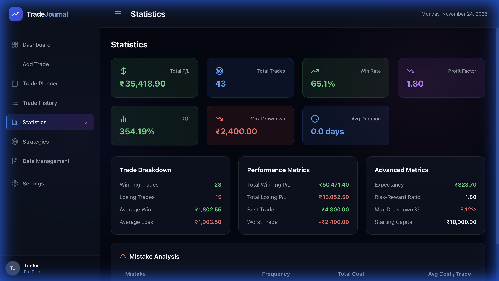
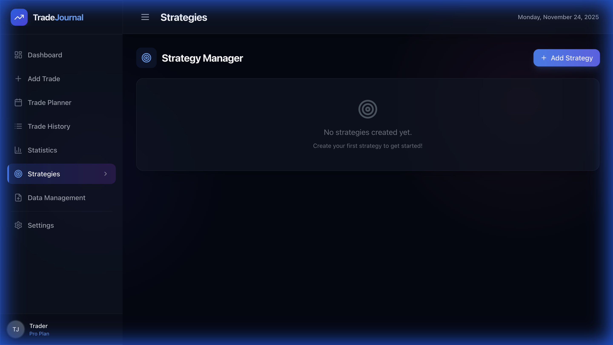

# Trading Journal

A modern, feature-rich trading journal application built with React and Vite. Track your trades, analyze performance, manage strategies, and improve your trading with comprehensive analytics and planning tools.


## ✨ Features

### 📊 Dashboard
Get a comprehensive overview of your trading performance at a glance with key metrics, charts, and recent activity.


### 📝 Trade Entry & Management
Record trades with detailed information including:
- Symbol (stocks, crypto, forex, etc.)
- Trade type (Long/Short)
- Entry and exit prices
- Quantity and position size
- Entry and exit dates
- Strategy tags
- Detailed notes and observations
- P/L calculations (automatic)



### 📅 Trade Planner
Plan your trades before execution with:
- Pre-trade analysis
- Risk/reward calculations
- Entry and exit targets
- Stop loss planning
- Convert planned trades to actual trades



### 📈 Trade History
View and manage all your trades in a clean, sortable table with:
- Comprehensive trade details
- Quick edit and delete actions
- Export functionality
- Filtering and search capabilities



### 📉 Statistics & Analytics
Analyze your performance with comprehensive statistics including:
- Total P/L with visual indicators
- Win rate percentage
- Profit factor
- Average win/loss amounts
- Best and worst trades
- Performance charts and trends
- Monthly/weekly breakdowns



### 🎯 Strategy Manager
Organize and track your trading strategies:
- Create custom strategies
- Tag trades with strategies
- Analyze strategy performance
- Compare strategy effectiveness



### 💾 Data Management
- **Local Storage**: All data saved securely in your browser
- **CSV Import/Export**: Import trades from broker statements or export for backup
- **Data Privacy**: Your data never leaves your device

### 🎨 Modern UI/UX
- Beautiful, responsive design with premium dark glass theme
- Smooth animations and transitions
- Mobile-friendly interface
- Intuitive navigation
- Accessible components

## 🚀 Getting Started

### Prerequisites

- Node.js (v16 or higher)
- npm or yarn

### Installation

1. Clone the repository:
```bash
git clone <repository-url>
cd trading-journal
```

2. Install dependencies:
```bash
npm install
```

3. Start the development server:
```bash
npm run dev
```

4. Open your browser and navigate to `http://localhost:5173`

### Build for Production

```bash
npm run build
```

The built files will be in the `dist` directory.

## 📖 Usage Guide

### Adding a Trade

1. Click on **"Add Trade"** in the sidebar
2. Fill in the trade details:
   - Enter the symbol (e.g., AAPL, BTC/USD, EUR/USD)
   - Select trade type (Long or Short)
   - Enter entry and exit prices
   - Specify quantity
   - Set entry and exit dates
   - Optionally select a strategy
   - Add notes about the trade setup and execution
3. Click **"Add Trade"** to save

### Planning a Trade

1. Navigate to **"Trade Planner"**
2. Analyze your potential trade setup
3. Set entry targets, stop loss, and take profit levels
4. Calculate risk/reward ratio
5. Convert to actual trade when executed

### Viewing History

1. Click on **"Trade History"** to see all recorded trades
2. Use the table to sort by different columns
3. Edit or delete trades as needed
4. Export your data for backup or analysis

### Analyzing Performance

1. Go to **"Statistics"** to view your trading metrics
2. Review win rate, profit factor, and other key metrics
3. Identify your best and worst performing trades
4. Track your progress over time

### Managing Strategies

1. Navigate to **"Strategies"**
2. Create new strategies or edit existing ones
3. Tag trades with strategies for performance tracking
4. Compare strategy effectiveness

## 🛠️ Technologies Used

- **React 18** - Modern UI library
- **Vite** - Fast build tool and dev server
- **Tailwind CSS** - Utility-first CSS framework
- **Lucide React** - Beautiful icon library
- **Lightweight Charts** - Professional charting library
- **Local Storage API** - Client-side data persistence

## 📁 Project Structure

```
trading-journal/
├── src/
│   ├── components/
│   │   ├── Dashboard.jsx
│   │   ├── TradeForm.jsx
│   │   ├── TradePlanner.jsx
│   │   ├── TradeList.jsx
│   │   ├── Statistics.jsx
│   │   ├── StrategyManager.jsx
│   │   ├── CSVManager.jsx
│   │   └── Settings.jsx
│   ├── utils/
│   │   └── storage.js
│   ├── App.jsx
│   └── main.jsx
├── assets/
│   └── screenshots/
├── index.html
├── package.json
├── tailwind.config.js
└── vite.config.js
```

## 💡 Tips for Best Results

1. **Be Consistent**: Record every trade to get accurate statistics
2. **Use Notes**: Document your thought process and lessons learned
3. **Tag Strategies**: Organize trades by strategy to identify what works
4. **Review Regularly**: Use statistics to identify patterns and improve
5. **Plan Ahead**: Use the trade planner for better decision-making
6. **Backup Data**: Regularly export your trades as CSV for safekeeping

## 🔒 Data Storage & Privacy

All trades are stored in your browser's local storage. This means:
- ✅ Your data stays on your device
- ✅ No account or login required
- ✅ Data persists between sessions
- ✅ Complete privacy - no data sent to servers
- ⚠️ Clear browser data will delete your trades (export regularly!)

## 🎯 Future Enhancements

- [ ] Cloud sync and backup
- [ ] Advanced charting and technical analysis
- [ ] Trade screenshots and attachments
- [ ] Performance goals and targets
- [ ] Mobile app version
- [ ] Multi-currency support
- [ ] Tax reporting features

## 📄 License

Created by **Farhath B**

---

**Happy Trading! 📈**
